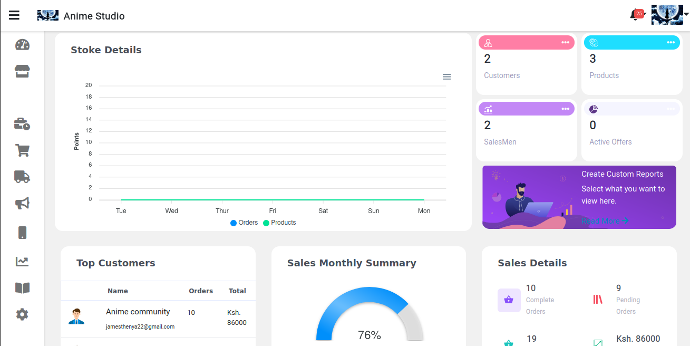
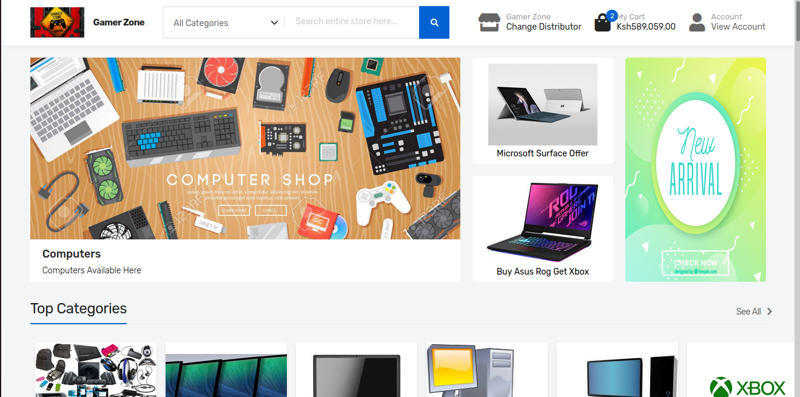
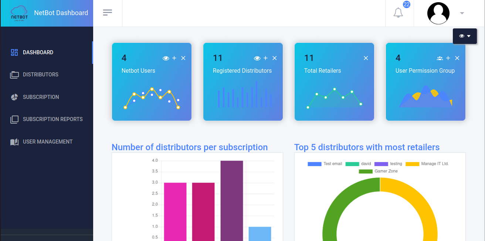

## General Information

The project includes a comprehensive admin panel for distributors, enabling them to manage their entire retail network efficiently. From this web-based panel, distributors can register new retailers, assign salespeople to retailers, and oversee the entire order lifecycle. Distributors have full control over approving orders placed by retailers and their sales teams, ensuring seamless delivery and fulfillment. The panel also supports advanced sales force automation, allowing distributors to track sales performance, manage inventory, and streamline communication with their teams.

Both retailers and salespeople use mobile apps, developed with Flutter, to place orders, providing them with flexibility and ease of access. These mobile applications are tightly integrated with the distributor's admin panel, allowing for real-time order tracking and approvals. Built using React, Redux, and Django, the system ensures a fast and scalable solution for managing large volumes of transactions. Firebase is incorporated for instant notifications, keeping retailers and salespeople updated on order statuses and delivery schedules. This dynamic platform optimizes the supply chain, enhances salesforce productivity, and ensures smooth communication between all parties involved, from order placement to final delivery.

## Technologies Used

- Django - version 3.2
- React
- -React
- Node js - version 14.7
- Bash scripts - version 5.0

## Features

List the ready features here:

- Scm Panel
- Customers Panel
- Admin View

## Screenshots

